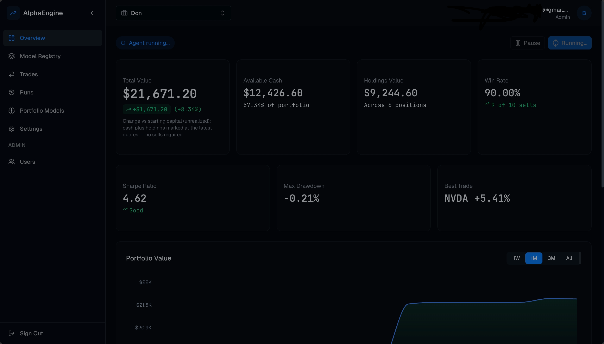

# AlphaEngine

AlphaEngine is an end-to-end paper-trading platform with a FastAPI backend and Next.js dashboard.
It combines real market data, ML model training, and an automated portfolio agent so you can test ideas without risking capital.

Live demo: [alphaenginestock.vercel.app](https://alphaenginestock.vercel.app)

<p align="center">
   
</p>

## Highlights

- Paper portfolios with cash, holdings, transaction history, and performance tracking
- Real market data pipeline with provider fallback support
- Global model registry per ticker (LSTM + XGBoost coverage)
- Scheduled and manual agent runs with BUY / SELL / HOLD decisions
- Dashboard with portfolio value chart, holdings, and recent trades
- Admin workflows for user and model operations

## Architecture

- Frontend: Next.js 16, React 19, TypeScript, Tailwind CSS, React Query
- Backend: FastAPI, SQLAlchemy (async), APScheduler
- ML: XGBoost, scikit-learn, TA features, optional LLM-assisted decisions
- Storage: Postgres + Supabase model artifact bucket
- Deploy targets: Vercel (client) + Render (server)

## Repository Structure

| Path | Purpose |
|---|---|
| `client/` | Next.js app (UI, dashboard, admin, API proxy routes) |
| `server/` | FastAPI app (auth, portfolios, trades, models, agent, scheduler) |
| `server/scripts/` | Database bootstrap and migration SQL scripts |
| `render.yaml` | Render blueprint for backend service |
| `IDEA.md` | Product and vision notes |

## Quick Start

### 1. Run the backend

From the repository root:

```bash
cd server
python -m venv .venv
source .venv/bin/activate
pip install -r requirements.txt
pip install --index-url https://download.pytorch.org/whl/cpu torch==2.3.0
cp .env.example .env
```

Set required environment variables in `.env`:

- `DATABASE_URL`
- `JWT_SECRET` (minimum 32 chars)
- `ADMIN_EMAIL`
- `ADMIN_PASSWORD`

Initialize and seed:

```bash
python scripts/init_db.py
python scripts/seed_admin.py
```

Start API:

```bash
uvicorn main:app --host 0.0.0.0 --port 8000 --reload
```

Backend health: `http://localhost:8000/health`

### 2. Run the frontend

In a new terminal:

```bash
cd client
pnpm install
NEXT_PUBLIC_API_URL=http://localhost:8000 pnpm dev
```

Frontend app: `http://localhost:3000`

## Configuration Notes

### Core backend env vars

- Auth + DB: `DATABASE_URL`, `JWT_SECRET`, `ADMIN_EMAIL`, `ADMIN_PASSWORD`
- Market/news providers: `STOOQ_API_KEY`, `FINNHUB_API_KEY`, `ALPHA_VANTAGE_KEY`, `NEWS_API_KEY`
- Agent mode: `AGENT_DECISION_MODE` (`rules`, `hybrid`, `gemini`)
- Model artifacts: `SUPABASE_URL`, `SUPABASE_SERVICE_KEY`, `SUPABASE_BUCKET`
- Scheduler: `AGENT_CRON_ENABLED`, `AGENT_CRON_DAY_OF_WEEK`, `AGENT_CRON_MINUTE`, `AGENT_CRON_HOURS`, `MARKET_TIMEZONE`
- Hosting keep-alive: `RENDER_EXTERNAL_URL`

### Scheduler behavior

The backend supports multi-run trading-day scheduling using `AGENT_CRON_HOURS` (default: `9,12,15`) and manual Run Now actions from the dashboard.
If your host sleeps on idle, in-process schedules only execute while the service is awake.

## Typical Workflow

1. Log in with seeded admin credentials
2. Create a portfolio with valid ticker symbols
3. Open the models section and retrain tracked tickers if needed
4. Run the agent manually or wait for the next scheduled run
5. Inspect holdings, transactions, and value/performance charts

## API Surface (High-Level)

- `/api/v1/auth/*` for login and session checks
- `/api/v1/portfolios/*` for portfolio management
- `/api/v1/trades/*` and dashboard endpoints for analytics/history
- `/api/v1/models/*` for model training and registry operations
- `/api/v1/agent/*` for agent orchestration

See backend implementation details in `server/README.md`.

## Deployment

- Frontend: Deploy `client/` to Vercel and set `NEXT_PUBLIC_API_URL` to backend URL
- Backend: Deploy `server/` (Docker) on Render, using `render.yaml` as a starting point
- Ensure production secrets are configured in host dashboards

## Disclaimer

Paper trading only. This project is for simulation and education, not financial advice.
