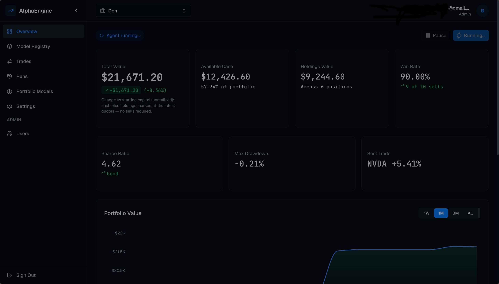

# AlphaEngine

**A paper-trading platform where an autonomous agent trades virtual portfolios using real market data, trained ML models, and a full audit trail of every decision.**

[](https://www.typescriptlang.org/)
[](https://www.python.org/)
[](https://fastapi.tiangolo.com/)
[](https://nextjs.org/)

Live demo: [alphaenginestock.vercel.app](https://alphaenginestock.vercel.app)

<p align="center">
  
</p>

## What it is

AlphaEngine runs virtual stock portfolios against live market data. On a schedule (or on demand), a decision engine pulls real prices, technical indicators, news sentiment, and predictions from per-ticker ML models, then decides to BUY, SELL, or HOLD — and executes the trade against a simulated cash balance. No real money ever moves. Every decision — the model outputs it saw, the rule that fired, and (when enabled) the LLM's rationale — is written to the database next to the trade, so you can open any transaction and see exactly why it happened.

It exists to make quant/ML workflows tangible: training a real model per ticker, backtesting a real decision loop, and watching it operate over time, without the cost or risk of a live brokerage.

## Features

- **Paper portfolios** — multiple independent portfolios, each with its own cash balance, holdings, transaction history, and P&L.
- **Real market data with provider fallback** — daily OHLCV and quotes are pulled from a provider chain (Stooq → Finnhub → Yahoo Finance → Alpha Vantage, configurable), so one dead provider doesn't take down the pipeline.
- **Per-ticker ML models** — a PyTorch LSTM (price/return prediction) and an XGBoost classifier (up/down direction) are trained per ticker on technical features (RSI, MACD, Bollinger Bands, rolling returns) and stored in Supabase Storage. If a ticker has no trained model yet, the system falls back to a transparent momentum heuristic instead of failing.
- **Hybrid decision engine** — a deterministic rule set (confidence, RSI bounds, sentiment thresholds, position sizing) always runs and can optionally be refined by a Gemini call that reasons over the same signals; hard risk rails (position caps, cash checks) apply regardless of which path produced the decision. Runs in pure-rules mode automatically if no Gemini key is configured.
- **Full decision traces** — every trade stores the model predictions, technical signals, sentiment score, which decision path (rules vs. LLM) fired, and the reasoning text behind it.
- **Scheduled + adaptive agent runs** — a fixed intraday schedule plus per-portfolio adaptive follow-ups (sooner after high-confidence or trade-producing runs, later after tool errors), skipping weekends and US market holidays.
- **News sentiment** — headlines fetched per ticker (NewsAPI) and scored with a lightweight keyword-based scorer feeding into the decision engine.
- **Model health & retraining** — accuracy tracking per model, a weekly retrain job, and automatic retraining when a model's rolling 7-day accuracy drops below 52%.
- **Auth & admin** — JWT-based auth seeded from environment variables, bcrypt password hashing, and an admin panel for managing additional users.
- **Dashboard** — portfolio value chart, holdings, recent trades, model registry/accuracy, and a transaction history with the full reasoning behind each trade.

### Roadmap / not fully wired yet

- The Gemini decision path is real and callable, but it's a single-shot reasoning call over precomputed signals rather than an agent that dynamically calls tools mid-run — a true tool-calling loop (agent decides *which* signal to fetch next) is a natural next step.
- News sentiment scoring is keyword-based, not a trained NLP/sentiment model.
- No automated test suite yet.

## Tech Stack

**Backend** — Python, FastAPI, SQLAlchemy (async) + PostgreSQL, Alembic-style init scripts, APScheduler for cron/adaptive scheduling, JWT auth (python-jose + bcrypt).

**ML** — PyTorch (LSTM), XGBoost + scikit-learn (direction classifier), `ta` for technical indicators, model artifacts versioned in Supabase Storage.

**Market data & news** — Stooq, Finnhub, yfinance (Yahoo Finance), Alpha Vantage (provider chain with fallback), NewsAPI for headlines.

**AI agent** — Google Gemini (`gemini-1.5-flash`) for optional LLM-assisted decisions, layered on top of the deterministic rule engine.

**Frontend** — Next.js 16 (App Router), React 19, TypeScript, Tailwind CSS, shadcn/ui, TanStack Query, Recharts.

**Infra** — Render (backend, Docker), Vercel (frontend), Render Postgres, Supabase Storage.

## Architecture

```
Client (Next.js)  ──HTTPS + JWT──►  FastAPI (Render)
                                        │
                    ┌───────────────────┼────────────────────┐
                    │                   │                    │
              PostgreSQL          APScheduler            External APIs
        (users, portfolios,   (intraday agent runs,   Stooq / Finnhub / Yahoo /
         trades, models,       weekly retrain,          Alpha Vantage / NewsAPI /
         prediction history)   keep-alive ping)          Gemini
                                        │
                                Supabase Storage
                              (LSTM .pt / XGBoost .pkl)
```

### Data flow

1. `data/market_data.py` fetches daily OHLCV through a provider chain (Stooq first by default, then Finnhub, Yahoo, Alpha Vantage), caching the last good frame per ticker so a transient outage doesn't break scoring.
2. `ml/features.py` derives RSI, MACD (+ signal), Bollinger Band position, volume ratio, and 5/10/20-day returns from that OHLCV data.
3. `data/news_fetcher.py` pulls recent headlines per ticker from NewsAPI and scores them with a keyword-based sentiment function.

### Model pipeline

- `ml/model_fit.py` trains an XGBoost classifier (`fit_xgb_direction`) on next-day direction and a small PyTorch LSTM (`fit_lstm_price_direction`) on normalized feature windows, per ticker, with a holdout split for accuracy.
- `ml/trainer.py` orchestrates training across all tickers currently held in any portfolio, uploads the resulting `.pkl`/`.pt` artifacts to Supabase Storage, and records accuracy in the model registry.
- A weekly job (`scheduler/jobs.py::retrain_all_models_job`, gated behind `MODEL_RETRAIN_ENABLED`) retrains every active ticker on the latest historical window; a separate accuracy check triggers an early retrain if rolling accuracy drops below 52%.
- `ml/predictor.py` loads the cached model bundle at inference time and falls back to a momentum-based heuristic (recent mean return/volatility) if no trained model exists yet for that ticker.

### Agent decision loop

For each ticker in a portfolio, `agent/runner.py`:

1. Calls the LSTM predictor, XGBoost classifier, technical signals, sentiment score, and current portfolio status (`agent/tools.py`).
2. Computes a deterministic baseline decision (`_rule_decision`) from those signals: buy on bullish direction + acceptable RSI + non-negative sentiment with confidence-scaled position sizing, sell on bearish reversal signals, otherwise hold.
3. If `AGENT_DECISION_MODE` allows it and a Gemini key is configured, sends the same signals plus the baseline decision to Gemini and asks for a structured JSON verdict; on any failure or missing key it silently falls back to the rule-only baseline.
4. Merges the two into a final decision, re-applying hard limits (cash floor, max 10% of portfolio in one position, valid sell fraction) regardless of which source produced the call.
5. Executes the trade, records the LSTM prediction for later accuracy scoring, and writes the full reasoning + signal payload onto the transaction.
6. Reschedules the portfolio's next adaptive run based on confidence and whether trades were made.

## Getting Started

### Prerequisites

- Python 3.12+
- Node.js 18+ and pnpm
- A PostgreSQL database (local or hosted)
- Optional: Supabase project (model storage), Gemini API key, Finnhub/Alpha Vantage/NewsAPI/Stooq keys

### Backend

```bash
cd server
python -m venv .venv
source .venv/bin/activate
pip install -r requirements.txt
pip install --index-url https://download.pytorch.org/whl/cpu torch==2.3.0

cp .env.example .env
# set DATABASE_URL, JWT_SECRET (32+ chars), ADMIN_EMAIL, ADMIN_PASSWORD at minimum

python scripts/init_db.py
python scripts/seed_admin.py

uvicorn main:app --host 0.0.0.0 --port 8000 --reload
```

Backend health check: `http://localhost:8000/health`

### Frontend

```bash
cd client
pnpm install
NEXT_PUBLIC_API_URL=http://localhost:8000 pnpm dev
```

App: `http://localhost:3000`

## Usage

1. Log in with the seeded admin credentials.
2. Create a portfolio with a starting cash balance and a list of tickers.
3. Open the models page and train the tracked tickers (or wait for the next scheduled retrain).
4. Trigger an agent run manually, or let the scheduler run it at the next configured market session.
5. Inspect holdings, transactions, and the value/performance chart — click into any trade to see the model predictions, signals, and reasoning behind it.

## Configuration reference

| Variable | Purpose |
|---|---|
| `DATABASE_URL`, `JWT_SECRET`, `ADMIN_EMAIL`, `ADMIN_PASSWORD` | Required — auth and database |
| `SUPABASE_URL`, `SUPABASE_SERVICE_KEY`, `SUPABASE_BUCKET` | Model artifact storage |
| `GEMINI_API_KEY`, `AGENT_DECISION_MODE` | LLM-assisted decisions (`rules`, `hybrid`, `gemini`); defaults to `hybrid`, degrades to rules-only without a key |
| `STOOQ_API_KEY`, `FINNHUB_API_KEY`, `ALPHA_VANTAGE_KEY` | Market data providers |
| `NEWS_API_KEY` | Headline sentiment |
| `AGENT_CRON_HOURS`, `MARKET_TIMEZONE` | Scheduled agent run times |
| `MODEL_RETRAIN_ENABLED` | Enables the weekly retrain job (off by default) |
| `RENDER_EXTERNAL_URL` | Self keep-alive ping target on free hosting tiers |

See `server/.env.example` for the full list and `server/README.md` for backend-specific notes.

## Deployment

- **Frontend**: deploy `client/` to Vercel, set `NEXT_PUBLIC_API_URL` to the backend URL.
- **Backend**: deploy `server/` (Docker) to Render using `render.yaml` as a starting point, or any Docker host (Fly.io, Railway).

## Disclaimer

Paper trading only. AlphaEngine is for simulation, learning, and portfolio-building — not financial advice, and not connected to any real brokerage or real money.
